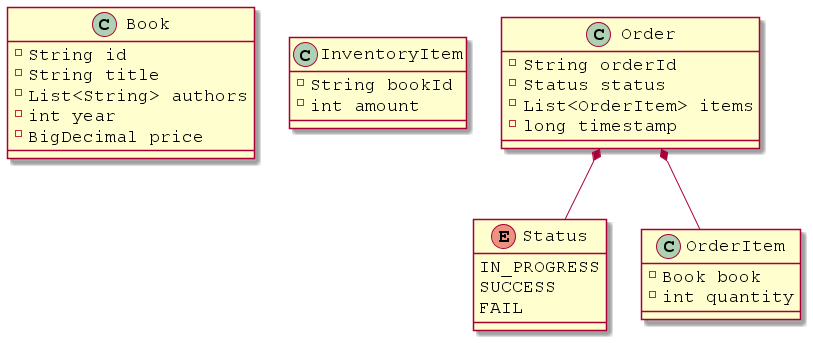

# Logical Book Store Project

This is a book store application, written in Java and Spring Boot for the purpose of interviewing candidates.

## Project Overview

Logical Book Store application is a software for managing an imaginary online book store.
It has three APIs that allow you to:
* Manage Product Catalog - add and remove books, view what books are available;
* Manage Inventory - add more items for the positions available in Product Catalog;
* Manage Orders - place orders for available items and view order history.

## Prerequisites
TODO

## Running the application
TODO

## Domain Model
TODO

## API description
TODO
